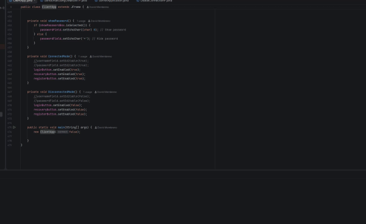

# Java Auth System



A desktop user authentication system built in Java with a Swing GUI and MySQL persistence. Users can register, log in, change their password, and recover a locked account by email. An admin control panel shows registered users, logged-in users, locked-out accounts, and active connections in real time.

This was a four-person team project for CSC335 (Software Engineering) at California Lutheran University. The team followed a requirements-first process, producing an RFP response, use cases, user stories, UML diagrams, and a test plan before writing code.

---

## Features

- **Registration** with email format validation and password rules (at least 8 characters, including a lowercase letter and a number)
- **Login** with credential checks against the MySQL database
- **Account lockout** after 3 consecutive failed login attempts
- **Password recovery** by email through Gmail SMTP
- **Password change** for logged-in users
- **Admin control panel** that refreshes every second with live user and connection data
- **Background threading** so database work doesn't freeze the GUI

---

## Tech Stack

| Layer | Technology |
|---|---|
| Language | Java 17 |
| GUI | Java Swing |
| Database | MySQL 8.4+ via JDBC (`mysql-connector-j`) |
| Email | Gmail SMTP via `javax.mail` |
| Design | UMLet (class, sequence, state machine, and use case diagrams) |

---

## Design Documents

Before implementation, the team produced a full set of design artifacts.

| Document | Purpose |
|---|---|
| [Use Case Diagram](diagrams/Use%20Case%20Diagram%20Client-Server-System.pdf) | Actors and system interactions for client and server |
| [Class Diagram](diagrams/Class%20Diagram.pdf) | Planned classes and their relationships |
| [Sequence Diagrams](diagrams/Sequence%20Diagrams.pdf) | Message flow for each use case |
| [State Machine Diagram](diagrams/State%20Machine%20Diagram.pdf) | The client experience from launch to shutdown |
| [Test Plan](docs/Test%20Plan%20Document.pdf) | Functional and integration test cases derived from user stories |
| [Summary Document](docs/Summary%20Document.pdf) | Project overview and outcomes |

---

## Design vs. Implementation

The class design was completed before development began. As the system was built, the team simplified the architecture, and two planned classes were dropped entirely. These are marked in red in the original class descriptions.

| Planned class | Implemented as | Notes |
|---|---|---|
| `Network` | Not implemented | The planned TCP socket layer was descoped. The client connects to MySQL directly over JDBC instead of routing requests through a server process. |
| `User` | `accounts` table | A separate class would have duplicated the database row, so user data lives only in MySQL. |
| `ClientApplication` + `ClientGUI` | `ClientApp` | GUI and application logic merged into one class. |
| `ServerApplication` + `ServerGUI` | `ServerApplication` | Became an admin dashboard opened from the client after login. |
| `UserDatabase` | `DBaseConnectionP` | Handles all queries and updates. |
| `PasswordValidator` | `PasswordAuthernticator` | Regex-based password rule check. |
| `EmailService` | `SendEmailUsingGMailSMTP` | Sends recovery and lockout emails. |
| `Session` | `connections` table | Connections are counted in the database rather than tracked as objects. |
| `AuthenticationService` | `AuthenticationService` | Implemented as planned. |

The biggest change is architectural. The original design was a three-tier client/server system (client → network → server → database). The delivered system is two-tier (client → database), with the "server" acting as an admin view over the same database.

---

## Testing

A full [test plan](docs/Test%20Plan%20Document.pdf) covering connection, registration, login, lockout, recovery, password change, and shutdown was written during the design phase using a grey-box, bottom-up integration approach. It was not formally executed before the course ended.

While setting the project up again after the course, manual checks against the plan surfaced the bugs listed below, including a failure of the plan's "server unreachable" test case.

---

## Bugs Found and Fixed

These were identified and fixed while reviving the project:

- **Public key retrieval error.** Newer MySQL servers refused the connection because SSL was disabled. Fixed by adding `allowPublicKeyRetrieval=true` to the JDBC URL for local development.
- **Admin panel failing silently.** The dashboard constructor wrapped everything in an empty `catch` block, so any error made the window quietly disappear. Added error reporting to expose the real cause.
- **JDBC race condition.** The admin panel's background refresh thread and its constructor shared a single `Statement`, so one query could close another's results mid-read. Fixed by giving the connection count query its own statement and synchronizing the shared database methods.

---

## Known Issues and Limitations

These are documented intentionally as areas for future improvement:

- **Plain-text passwords.** Passwords are stored as-is. A production system would hash them with an algorithm like bcrypt.
- **SQL injection risk.** Queries are built with string concatenation. They should be rewritten with `PreparedStatement` parameters.
- **No network layer.** The planned TCP client/server layer was never built, so the client must run on the same machine as the database.
- **Misleading connection status.** The client reports "Connected" even when the database connection fails, because the error is caught and only printed to the console.
- **No unique constraint on usernames.** Duplicate prevention relies on application code rather than the database schema.
- **SSL disabled.** Acceptable for local development only.

---

## How to Run

### 1. Set up MySQL

Install MySQL Community Server 8.4 or newer, then create the database and tables:

```sql
CREATE DATABASE csc335;
USE csc335;

CREATE TABLE accounts (
  id INT NOT NULL AUTO_INCREMENT,
  username VARCHAR(45) NOT NULL,
  password VARCHAR(45) NOT NULL,
  email VARCHAR(45) NOT NULL,
  active INT UNSIGNED NOT NULL,
  lockedout INT UNSIGNED NOT NULL,
  attempts INT NOT NULL,
  PRIMARY KEY (id)
);

CREATE TABLE connections (
  user INT NOT NULL AUTO_INCREMENT,
  PRIMARY KEY (user)
);

INSERT INTO accounts (username, password, email, active, lockedout, attempts)
VALUES ('demo_user', 'Password123', 'demo@example.com', 0, 0, 0);
```

The original database dumps are also in the [`sql`](sql) folder.

### 2. Open the project in IntelliJ IDEA

Open the repository folder and set the project SDK to JDK 17. Mark `src` as a Sources Root if needed.

### 3. Add dependencies

In **File → Project Structure → Libraries → + → From Maven**, add:

```
com.mysql:mysql-connector-j:9.1.0
com.sun.mail:javax.mail:1.6.2
```

### 4. Set environment variables

The code reads credentials with `System.getenv`. In the run configuration for `client.ClientApp`, set:

```
DB_USER=root;DB_PASS=your_mysql_password
```

To enable password recovery emails, also add `SMTP_USER` and `SMTP_PASS`, using a Gmail App Password rather than your normal password.

### 5. Run

Run `client.ClientApp`, enter `localhost` as the server address, click **Connect**, and log in as `demo_user` with password `Password123`. After logging in, the **Query** button opens the admin control panel.

---

## Team

Built by Jacob Glasby, Abraham Horta, Levi Horta, and David Membreno. The team planned and designed the system together and split implementation work as the project evolved, so most of the codebase reflects shared effort.

My own focus was the design side of the project: the UML diagrams, use cases, and test plan, along with early work on the client GUI. After the course ended, I revived the project on a fresh setup, rebuilt the database, fixed the bugs listed above, and wrote this documentation.